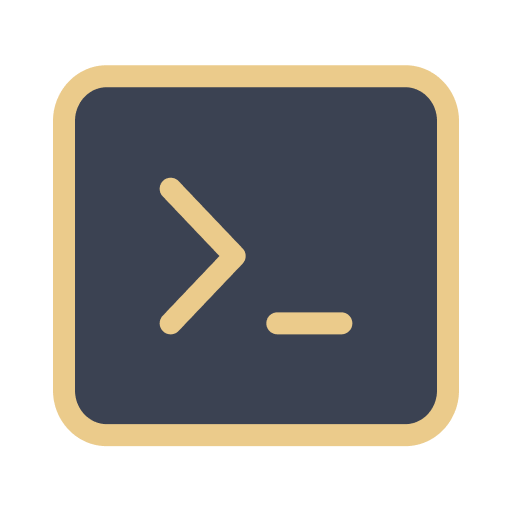

# TinkerTerm

<p align="center">
    
</p>

TinkerTerm is the desktop application for interacting with your Laravel projects. This powerful tool allows you to speed up your Laravel development with an intuitive and user-friendly interface for executing arbitrary PHP code, debugging, and exploring your data.

Some of the features of TinkerTerm:
- 😃 Intuitive and user-friendly interface
- 🛠️ Easy access to all of Laravel's Artisan commands
- 💻 Interactive shell for executing arbitrary PHP code
- 🕵️‍♂️ Advanced debugging and exploration tools
- 🔍 Built-in support for Laravel's Eloquent ORM

## System Requirements

- Rust >= 1.64.0 
- Cargo >= 1.64.0
- NodeJS >= v18.x.x

Currently, I haven't tested it on any platform other than Mac M1; adjust this path search for the PHP binary on your platform [here](https://github.com/ahmadrosid/TinkerTerm/blob/main/src-tauri/src/main.rs#L31).

## Demo


## How to install?

Clone this project.
```bash
git clone https://github.com/ahmadrosid/TinkerTerm.git
```

Install all dependencies.
```bash
npm install
```

Build the project.
```bash
npm run tauri build
```

If you are on M1 MacOS.
```bash
npm run tauri build --target aarch64-apple-darwin
```

## Contribution

Please make any PR if you want to add more additional tools or improve the code; currently, I don't have any idea what feature to be added next.
